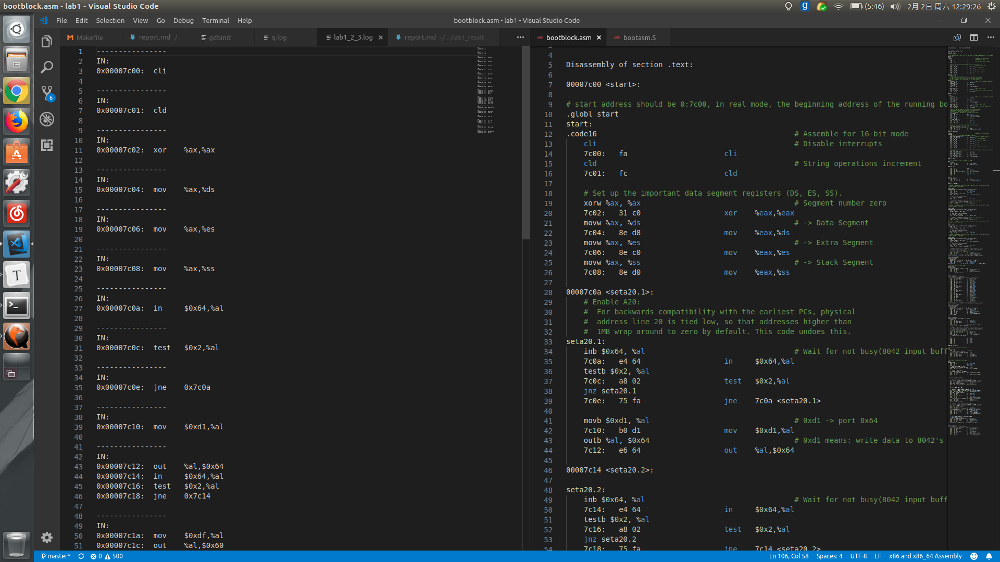
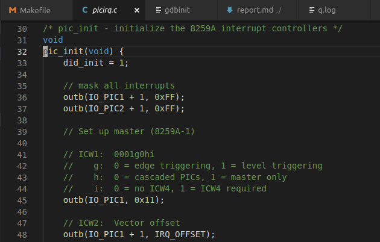
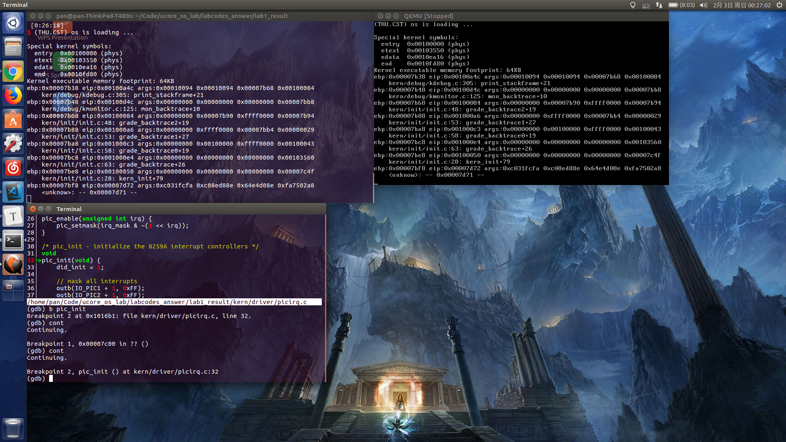

## lab1实验报告  

### 练习1  

1. ucore.img生成过程：

   生成ucore.img需要生成/bin/bootblock、/bin/kernel

   （1）生成kernel需要生成：

   ​		obj/kern/init/init.o 

   ​		obj/kern/libs/stdio.o 

   ​		obj/kern/libs/readline.o 

   ​		obj/kern/debug/panic.o 

   ​		obj/kern/debug/kdebug.o 

   ​		obj/kern/debug/kmonitor.o 

   ​		obj/kern/driver/clock.o 

   ​		obj/kern/driver/console.o 

   ​		obj/kern/driver/picirq.o 

   ​		obj/kern/driver/intr.o 

   ​		obj/kern/trap/trap.o 

   ​		obj/kern/trap/vectors.o 

   ​		obj/kern/trap/trapentry.o 

   ​		obj/kern/mm/pmm.o  

   ​		obj/libs/string.o 

   ​		obj/libs/printfmt.o

   （2）生成bootblock需要生成：

   ​		obj/bootblock.o

   ​		bin/sign

   ​	并执行bin/sign

2. 一个合法的主引导扇区需要的条件：

   最后一个字节为0x55

   倒数第二个字节为0xAA  

### 练习2  

使用qemu执行并调试lab1中的软件。

1、从CPU加电之后执行的第一条指令开始，单步跟踪BIOS的执行。

根据ucore_os_docs中lab1的附录B，修改tools/gdbinit

```shell
set architecture i8086
target remote :1234
```

然后在lab1目录下执行make debug，gdb将停在BIOS第一条指令处，通过

```shell
si
si
……
```

可以单步执行。

2、在初始化位置0x7c00设置实地址断点，测试断点正常。

在tools/gdbinit中追加如下代码

```shell
break *0x7c00
c
```

重新执行make debug可以发现gdb在0x7c00地址前暂停。

3、从0x7c00开始跟踪代码运行，将单步反汇编得到的代码与bootasm.S和bootblock.asm进行比较。

起初采用gdb单步调试并在命令行中打印出汇编代码的方法，可以得到大致对照，但是效率较低。

参考lab1答案之后，发现可以用-d in_asm -D q.log选项得到qemu代码的反汇编结果。

修改了Makefile中的debug部分：

```makefile
debug: $(UCOREIMG)
	$(V)$(QEMU) -d in_asm -D q.log -S -s -parallel stdio -hda $< -serial null &
	$(V)sleep 2
	$(V)$(TERMINAL) -e "gdb -q -tui -x tools/gdbinit"
```

修改tools/gdbinit，追加

```shell
b *0x7c00
c
```

执行make debug之后通过gdb单步执行，可以看到0x7c00-0x7c4a部分，得到的汇编代码与bootblock.asm中的汇编代码几乎都可以对应起来。



4、自己找一个bootloader或内核中的位置，设置断点并进行测试。

设置断点的位置





### 练习3  

